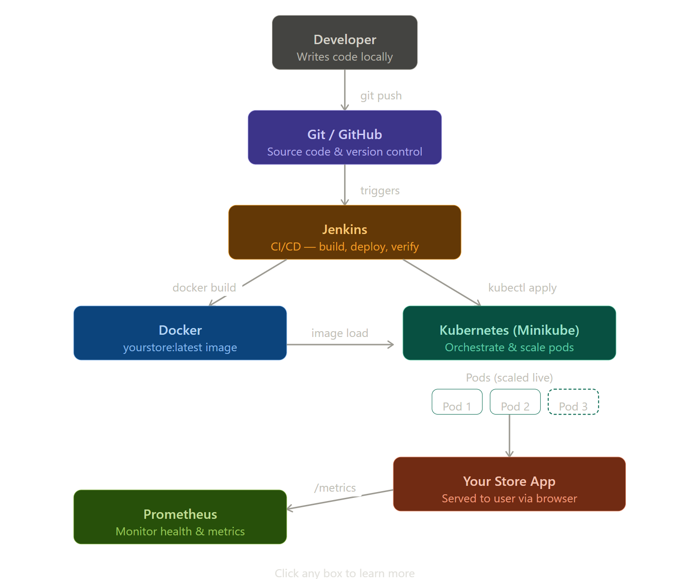

<div align="center">


# 🛍️ Your Store
### Quick Commerce for Local Clothing Stores

> A full-stack quick commerce web app with a complete DevOps pipeline —  
> containerized, orchestrated, automated, and monitored.

<br/>


</div>

---

## 📖 Table of Contents

- [About the Project](#-about-the-project)
- [Features](#-features)
- [Tech Stack](#-tech-stack)
- [DevOps Pipeline Architecture](#-devops-pipeline-architecture)
- [Tool Breakdown](#-tool-breakdown)
- [Getting Started](#-getting-started)
- [All Commands](#-all-commands)
- [Monitoring](#-monitoring)
- [Project Structure](#-project-structure)
- [Challenges and Solutions](#-challenges-and-solutions)
- [Future Scope](#-future-scope)
- [Author](#-author)

---

## 🚀 About the Project

**Your Store** is a quick commerce platform for local clothing stores — inspired by Zepto and Blinkit, but built for fashion. Users can browse clothing from nearby stores like **TrendZone**, **FabFashion**, and **UrbanWear**, and get items delivered fast.

But the real focus of this project is the **DevOps pipeline** built around the app — demonstrating how real-world software teams develop, containerize, deploy, automate, and monitor a production application using industry-standard tools.

---

## ✨ Features

- 🛒 Browse by category — Men, Women, Kids, Unisex, Ethnic, Sale
- 🏪 Multi-store support (TrendZone, FabFashion, UrbanWear)
- 📦 Add to cart and place orders
- 🚚 Real-time order tracking with delivery ETA
- 📊 Live health check and Prometheus metrics endpoints

---

## 🧰 Tech Stack

| Layer | Technology |
|---|---|
| Frontend | HTML, CSS, JavaScript (Single Page App) |
| Backend | Node.js + Express.js |
| Containerization | Docker |
| Orchestration | Kubernetes (Minikube) |
| CI/CD | Jenkins |
| Monitoring | Prometheus |
| Version Control | Git + GitHub |

---

## 🏗️ DevOps Pipeline Architecture

```

```

---

## 🔧 Tool Breakdown

###  Git & GitHub
Version control and remote code hosting. Every change is tracked and pushed to GitHub. Jenkins pulls from here automatically on every push.

---

###  Docker
The app is packaged into a Docker image called `yourstore:latest`. This ensures the app runs identically on any machine — no environment issues ever.

```dockerfile
FROM node:18-alpine
WORKDIR /app
COPY package*.json ./
RUN npm install
COPY . .
EXPOSE 3000
CMD ["node", "server.js"]
```

```bash
# Build
docker build -t yourstore:latest .

# Run locally
docker run -d -p 3000:3000 --name yourstore yourstore:latest
```

---

###  Kubernetes (Minikube)
Kubernetes manages, deploys, and scales the Docker containers. Minikube runs it locally for development and demo purposes.

```bash
minikube start
minikube image load yourstore:latest
kubectl apply -f deployment.yaml
kubectl scale deployment yourstore --replicas=3
kubectl get pods -w
```

---

###  Jenkins
Automates the entire pipeline — the moment code is pushed to GitHub, Jenkins clones, builds, loads, deploys, and verifies automatically.

```groovy
pipeline {
  agent any
  stages {
    stage('Clone') {
      steps { git 'https://github.com/abhimanyu284/Your-Store.git' }
    }
    stage('Build Docker Image') {
      steps { sh 'docker build -t yourstore:latest .' }
    }
    stage('Load into Minikube') {
      steps { sh 'minikube image load yourstore:latest' }
    }
    stage('Deploy to Kubernetes') {
      steps { sh 'kubectl apply -f deployment.yaml' }
    }
    stage('Verify') {
      steps { sh 'kubectl get pods' }
    }
  }
}
```

---

###  Prometheus
Monitors the app in real time by scraping the `/metrics` endpoint. Runs as a Docker container on port 9090.

```bash
docker run -d -p 9090:9090 \
  -v prometheus.yml:/etc/prometheus/prometheus.yml \
  prom/prometheus
```

---

## 🚀 Getting Started

### Prerequisites
- Node.js 18+
- Docker Desktop
- Minikube
- kubectl
- Jenkins

### Installation

```bash
# 1. Clone the repo
git clone https://github.com/abhimanyu284/Your-Store.git
cd Your-Store

# 2. Install dependencies
npm install

# 3. Run locally (without Docker)
node server.js

# 4. Or run with Docker
docker build -t yourstore:latest .
docker run -d -p 3000:3000 --name yourstore yourstore:latest

# 5. Open the app
# http://localhost:3000
```

---

## 📋 All Commands

<details>
<summary>Git Commands</summary>

```bash
git init
git add .
git commit -m "Initial commit"
git remote set-url origin https://github.com/abhimanyu284/Your-Store.git
git push -u origin main --force
```
</details>

<details>
<summary>Docker Commands</summary>

```bash
docker build -t yourstore:latest .
docker run -d -p 3000:3000 --name yourstore yourstore:latest
docker stop yourstore
docker rm yourstore
```
</details>

<details>
<summary>Kubernetes Commands</summary>

```bash
minikube start
minikube image load yourstore:latest
kubectl apply -f deployment.yaml
kubectl get pods
kubectl get services
minikube service yourstore-service
kubectl scale deployment yourstore --replicas=3
kubectl get pods -w
kubectl rollout restart deployment yourstore
```
</details>

<details>
<summary>Prometheus Commands</summary>

```bash
docker run -d -p 9090:9090 \
  -v prometheus.yml:/etc/prometheus/prometheus.yml \
  prom/prometheus
```
</details>

---

## 📊 Monitoring

| Endpoint | Purpose |
|---|---|
| `http://localhost:3000` | Main application |
| `http://localhost:3000/health` | Health check (returns JSON status) |
| `http://localhost:3000/metrics` | Prometheus metrics scrape endpoint |
| `http://localhost:9090` | Prometheus dashboard |

---

## 📁 Project Structure

```
Your-Store/
├── public/
│   ├── index.html        # Frontend SPA
│   ├── style.css         # Styles
│   └── app.js            # Frontend JS
├── server.js             # Express backend
├── Dockerfile            # Docker build config
├── deployment.yaml       # Kubernetes deployment & service
├── prometheus.yml        # Prometheus scrape config
├── Jenkinsfile           # Jenkins CI/CD pipeline
└── README.md             # This file
```

---

## ⚠️ Challenges and Solutions

| Challenge | Solution |
|---|---|
| `git push` rejected due to remote changes | Used `git push --force` after setting correct remote URL |
| Docker image not found in Minikube | Used `minikube image load yourstore:latest` to load local image |
| Jenkins couldn't find `kubectl` or `docker` | Added tool paths to Jenkins environment variables |
| Prometheus couldn't reach `/metrics` | Changed `localhost` to host machine IP in `prometheus.yml` |
| Pods stuck in `ImagePullBackOff` | Set `imagePullPolicy: Never` in deployment.yaml |

---

## 🔮 Future Scope

- ☁️ Deploy to cloud (AWS EKS / GCP GKE)
- 📈 Grafana dashboards for visual monitoring
- ⚡ Horizontal Pod Autoscaling (HPA) based on traffic
- 🔐 Add authentication and user accounts
- 📱 Build a native Android app (already started in Android Studio)
- 🗄️ Integrate a real database (MongoDB / PostgreSQL)

---

## 🏁 Conclusion

The **Your Store** project successfully demonstrates a complete, production-grade DevOps pipeline applied to a real-world quick commerce application. By integrating Git/GitHub, Docker, Kubernetes, Jenkins, and Prometheus, the project showcases how modern software practices can be applied even at a small business scale.

Through this project we achieved:
- ✅ Seamless version control and collaboration using GitHub
- ✅ Consistent and portable deployment using Docker containerization
- ✅ Automated build and deployment cycles through Jenkins CI/CD
- ✅ Resilient and scalable container orchestration via Kubernetes with live pod scaling
- ✅ Real-time application monitoring using Prometheus metrics

The pipeline eliminates manual intervention at every stage — from code push to deployment to monitoring — mirroring how top technology companies manage their production systems.

---

## 👨‍💻 Author

**Abhimanyu Nema**  
[](https://github.com/abhimanyu284)

---

<div align="center">

Made with ❤️ for a DevOps demo  
⭐ Star this repo if it helped you!

</div>
